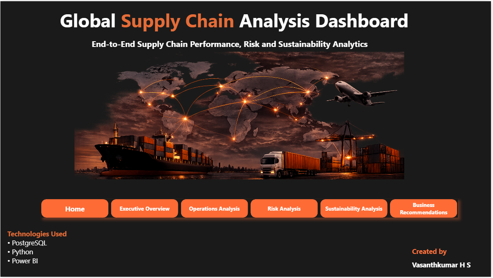
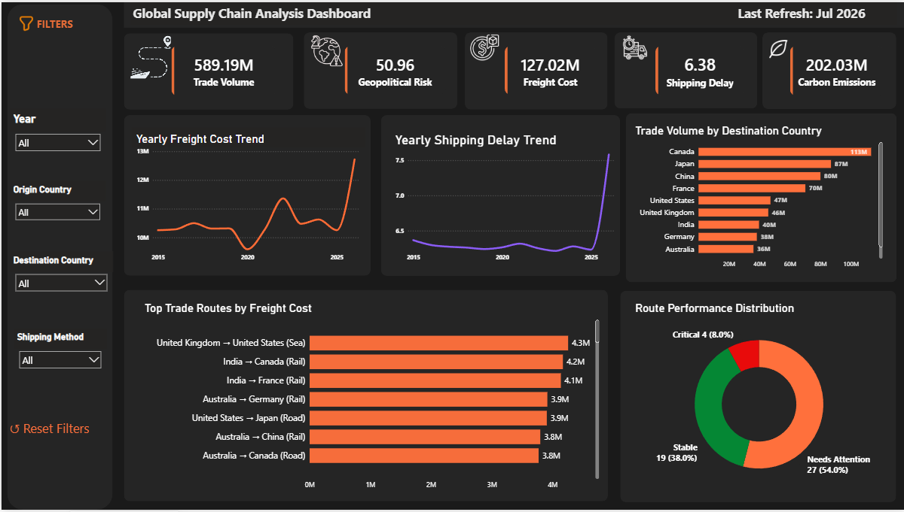
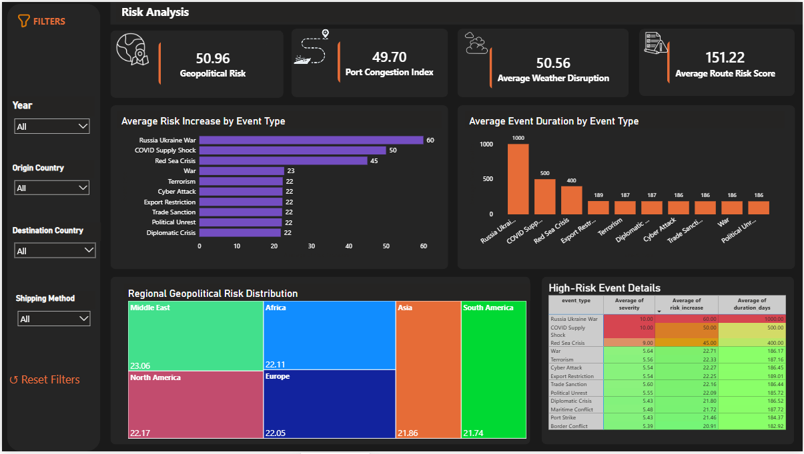
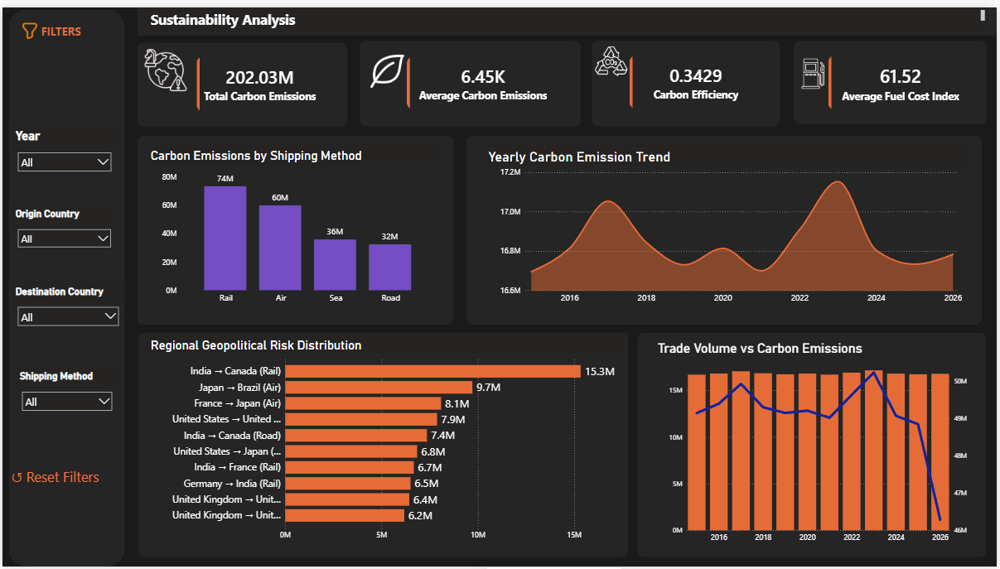
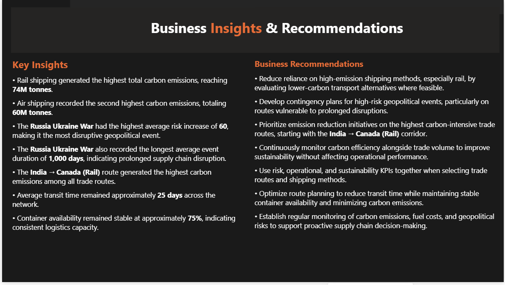
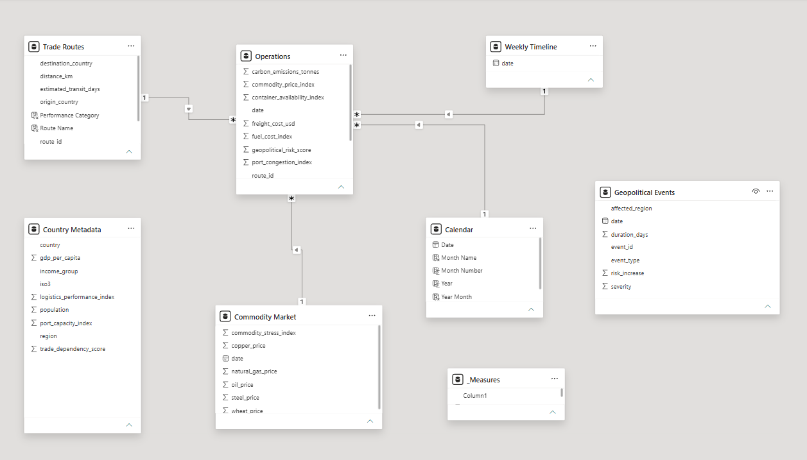

# 🌍 Global Supply Chain Analytics Dashboard

## End-to-End Supply Chain Analysis Using Python, PostgreSQL, SQL & Power BI

---

## Business Context

Global supply chains are increasingly affected by operational inefficiencies, geopolitical disruptions, rising transportation costs, and sustainability challenges. Organizations need a centralized analytics solution to monitor operations, identify risks, evaluate environmental impact, and support strategic decision-making.

This project delivers an end-to-end Supply Chain Analytics solution using Python, PostgreSQL, SQL, and Power BI. The analysis transforms raw operational data into actionable business insights through interactive dashboards and KPI-driven reporting.

---

# Dashboard Walkthrough

The dashboard consists of six pages.

• Home

• Executive Overview

• Operations Analysis

• Risk Analysis

• Sustainability Analysis

• Business Insights & Recommendations

---

# Key Findings

• Rail shipping generated the highest carbon emissions among all shipping methods.

• The Russia–Ukraine War recorded the highest geopolitical risk increase and the longest disruption duration.

• India → Canada (Rail) was identified as the most carbon-intensive trade route.

• Average transit time remained approximately 25 days across the supply chain.

• Container availability remained stable at approximately 75%, indicating consistent logistics capacity.

• Carbon emissions fluctuated over the years while trade volume remained relatively stable.

---

# Why This Matters

Supply chain performance cannot be measured using operational metrics alone.

This project combines operational performance, geopolitical risks, and sustainability indicators into a single analytical solution, enabling business leaders to:

• Monitor operational efficiency

• Identify high-risk trade routes

• Evaluate sustainability performance

• Support data-driven strategic planning

---

# Actionable Recommendations

• Reduce dependence on high-emission shipping methods by evaluating lower-carbon transportation alternatives.

• Develop contingency plans for regions affected by major geopolitical disruptions.

• Prioritize emission reduction initiatives for high carbon-intensive trade routes.

• Monitor carbon efficiency alongside trade volume to improve environmental performance.

• Integrate operational, risk, and sustainability KPIs into strategic supply chain planning.

---

# 📌 Project Overview

This project presents an end-to-end Global Supply Chain Analytics solution built using Python, PostgreSQL, SQL, and Power BI.

The project demonstrates the complete analytics workflow, including:

• Data Cleaning

• Data Validation

• Exploratory Data Analysis

• Database Loading

• Business Analysis

• Interactive Dashboard Development

• Business Insights

---

# Business Problem

How can organizations leverage operational, geopolitical, and sustainability data to improve supply chain efficiency while reducing risks and environmental impact?

---

# Project Workflow

Raw CSV Files

↓

Python

• Data Cleaning

• Data Validation

• Exploratory Data Analysis

↓

PostgreSQL

• Store Clean Data

↓

SQL

• Business Analysis Queries

↓

Power BI

• Data Modeling

• DAX Measures

• Interactive Dashboard

↓

Business Insights & Recommendations

---

# Dashboard Pages

## 🏠 Home

Project introduction, objectives, tools, navigation, and dataset overview.

---

## 📊 Executive Overview

Business KPIs

Yearly Trade Volume Trend

Freight Cost Analysis

Trade Performance

Executive Summary

---

## ⚙️ Operations Analysis

Transit Performance

Shipping Method Analysis

Port Congestion

Fuel Cost Trends

Operational KPIs

---

## ⚠️ Risk Analysis

Geopolitical Risk KPIs

Risk Event Analysis

Regional Risk Distribution

High-Risk Event Details

---

## 🌱 Sustainability Analysis

Carbon Emissions KPIs

Shipping Method Emissions

Carbon Emission Trend

Carbon Intensive Routes

Trade Volume vs Carbon Emissions

---

## 💡 Business Insights & Recommendations

Executive findings

Strategic recommendations

Business actions

---

# Data Model

The Power BI solution follows a Star Schema.

Dimension Tables

• Calendar

• Trade Routes

• Country Metadata

• Commodity Market

• Geopolitical Events

Fact Table

• Weekly Route Operations

---

# Data Quality Process

Python was used for:

• Missing value validation

• Data type correction

• Business rule validation

• Duplicate detection

• Exploratory Data Analysis

The cleaned data was loaded into PostgreSQL for SQL analysis and Power BI reporting.

---

# Tools & Technologies

• Python

• PostgreSQL

• SQL

• Power BI

• DAX

• Pandas

• NumPy

• Matplotlib

---

# Repository Structure

```text
Global_Supply_Chain_Analysis
│
├── Dashboard
├── Dataset
├── Python
├── SQL
├── Screenshots
├── README.md
├── requirements.txt
├── LICENSE
└── .gitignore
```

---

# Dashboard Screenshots

# Home



# Executive Overview



# Operations Analysis



# Risk Analysis


# Sustainability Analysis



# Business Insights



# Data Model


---

# Key Skills Demonstrated

✔ Data Cleaning

✔ Data Validation

✔ Exploratory Data Analysis

✔ PostgreSQL Database

✔ SQL Business Analysis

✔ Power BI Data Modeling

✔ DAX Measures

✔ Interactive Dashboard Development

✔ Business Intelligence

✔ Data Storytelling

---
# ⭐ Project Highlights

✔ End-to-end Supply Chain Analytics project

✔ Data Cleaning, Validation & EDA using Python

✔ Data stored and queried using PostgreSQL

✔ Business analysis performed using SQL

✔ Interactive Power BI dashboard with Star Schema and DAX

✔ Executive, Operations, Risk, Sustainability and Business Insights dashboards

✔ Business recommendations based on data-driven analysis

# Future Improvements

• Integrate live APIs for real-time logistics monitoring.

• Build predictive models for shipment delays.

• Forecast carbon emissions using Machine Learning.

• Deploy dashboards through Power BI Service.

---

# Contact

**Author:** Vasanthkumar H S

**LinkedIn:** *(linkedin.com/in/vasanthkumar-h-s-61bb5a291)*

**GitHub:** *((https://github.com/Vasanthkumar1718))*

---